# Java

Fundamentos de Java

## Tabla de contenido
- [Ambientes](#ambientes).
- [Versiones](#versiones).
- [Instalación JDK y Netbeans](#instalacion-jdk-y-netbeans).
- [Mi primer programa en Java](#mi-primer-programa-en-java).
- [Comentar el codigo](#comentar-el-codigo).
- [Tipos de datos](#tipos-de-datos).
- [Variables](#variables).
 - [Primitivos](#1-variables-de-tipo-primitivos).
 - [Referencias](#2-variables-de-tipo-referencias).
 - [Tipos de nombres asignados a una variable](#tipos-de-nombres-asignados-a-una-variable).
- [Operadores aritméticos](#operadores-aritmeticos).
 - [Operador modulo](#operador-modulo).
 - [Operadores de asignación](#operadores-de-asignacion).
 - [Operadores de incremento y decremento](#operadores-de-incremento-y-decremento).
 - [Operadores relacionales](#operadores-relacionales).
 - [Operadores lógicos](#operadores-logicos).
 - [Precedencia de operadores](#precedencia-de-operadores).
- [Promoción de datos o casting](#promocion-de-datos-o-casting).
- [Estructuras de decisión](#estructura-de-decision).
 - [Estructura del if](#estructura-del-if).
 - [Estructura del if-else](#estructura-del-if-else).
 - [Estructura del if-else-if-else](#estructura-del-if-else-if-else).
 - [Estructura del switch](#estructura-del-switch).
- [Estructuras de repetición](#estructuras-de-repeticion).
 - [Estructura for](#estructura-for).
 - [Estructura for each](#estructura-for-each).
 - [Estructura while](#estructura-while).
 - [Estructura-do-while](#estructura-do-while).
- [Arreglos](#arreglos).
 - [Arreglos unidimensionales](#arreglos-unidimensionales).
 - [Arreglos bidimensionales](#arreglos-bidimensionales).
 - [Usos habituales en los arreglos](#usos-habituales-en-los-arreglos).
  - [Busquedas](#busquedas).
  - [Conteos](#Conteos).
  - [Mayor y menor](#mayor-y-menor).
- [Programación orientado a objetos](#programacion-orientado-a-objetos).
 - [Evolución](#evolucion).
- [Clases](#clases).
- [Objetos](#objetos).
 - [Características](#caracteristicas).
 - [Instanciar un objeto](#instanciar-un-objeto).
- [Atributos](#atributos).
- [Métodos](#metodos).
 - [Setter y getter](#setter-y-getter).
 - [toString](#tostring).
- [Constructores](#constructores).
 - [Ordenamiento de datos](#ordenamiento-de-datos).
  - [Método Burbuja](#metodo-burbuja).
  - Inserción.
  - Selección.
  - QuickSort.
  - ShellSort.
  - MergeSort.
- [Sobrecarga de métodos](#sobrecarga-de-metodos).
- [Sobrecarga de constructores](#sobrecarga-de-constructores).
- [Apuntador this](#apuntador-this).
- [Ambitos de variables](#ambitos-de-variables).
- [Paquetes](#paquetes).
- [Modificadores de acceso](#modificadores-de-acceso).
 - [public](#public).
 - [private](#private).
 - [protected](#protected).
 - [static](#static).
 - [final](#final).
- [Herencia](#herencia).
 - [Sobreescritura de métodos](#sobreescritura-de-metodos).
 - [Apuntador super](#apuntador-super).
- [Abstracción](#abstraccion).
- [Clases abstractas](#clases-abstractas).
- [Polimorfismo](#polimorfismo).
- [Interfaces](#interfaces).
- [Manejo de excepciones](#manejo-de-excepciones).
 - [Clases de excepciones](#clases-de-excepciones).
 - [Atrapar excepciones con try, catch y finally](#atrapar-excepciones-con-try-catch-y-finally).
 - [Excepciones comunes](#excepciones-comunes).
 - [Atrapar excepciones con throws y throw](#atrapar-excepciones-con-throws-y-throw).


## Ambientes

Existe dos ambientes que se viven en la práctica en Java:

1. Donde se diseña y desarrolla el programa: Conocido como **JDK** (Java Development kit): Este sería el ambiente del programador, donde escribe su código, compila y hace las pruebas respectivas.

2. El usuario final: Conocido como **JRE** (Java Runtime Enviroment): Esto se le conoce como máquina virtual de java, que es un plugin en el cual se instala en las máquinas para que permita correr el programa creado en el lenguaje de programación java. Hoy en día este plugin viene instalado ya por defecto en la mayoría de exploradores de internet y sistemas operativos.

>Si el programa en java no corre en su equipo, es probable que deba descargar e instalar manualmente el plugin o complemento JRE, que está disponible en la página oficial de Oracle. 

La máquina virtual de Java (JRE) se utiliza por seguridad, para proteger tu código fuente contra personas inescrupulosas. De esta seguridad se encarga el equipo de desarrolladores Java y por eso este lenguaje es tan usado en el entorno empresarial, por su gran confiabilidad, aunque, como todos ya debemos de saber que no hay nada 100% seguro en lo que respecta a seguridad.

## Versiones

Java ofrece una versión gratuita para su descargar llamada J2SE (Estandar Edition) y que permite probar la plataforma de manera limitada. Cuando usted va a descargar java, no puede ser otra diferente a la J2SE, porque las otras versiones son comerciales y al descargarla le pedirá una licencia.

La versión comercial de Java se le conoce como J2EE (Enterprise Edition), es una versión costosa que tiene una cantidad de herramientas que complementa la J2SE. De todas formas, la versión J2SE le servirá a cualquier persona para aprender y solucionar muchos problemas con este lenguaje de programación.

También, existe una versión para trabajos enfocados en plataformas móviles, llamada la J2ME (Micro o Mobile Edition), que permite crear plataformas que se adapten bien a las diferentes resoluciones que hoy en día se ve en los dispositivos móviles.

No sobra decir que, todas estas versiones es de propiedad de la empresa Oracle.

## Instalacion JDK y Netbeans

Para empezar a programar en Java, debemos de descargar el kid de desarrollador de Java (JDK) y por comodidad un entorno de programación como Netbeans (aunque usted puede programar en un bloc de notas como en windows).

[Descargar el paquete de JDK y Netbeans integrado](http://www.oracle.com/technetwork/java/javase/downloads/index.html).

NOTA: Busque esta opción:

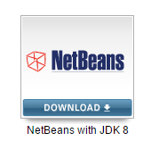

Al descargar, ejecutar el archivo y dar siguiente, siguiente... hasta que salga la opción terminar y listo! Ya puede correr programas en Java.

## Mi primer programa en Java

Un programa que imprima en pantalla el clásico ejemplo de **Hola Mundo!** desde Java.

>Este es un simple ejemplo de la sintaxis de java

1. Abrir Netbeans.
2. Sigue la siguiente ruta en Netbeans: Archivo - Nuevo proyecto - Categoría [java] - proyecto [Aplicación java] - Clic en siguiente - Coloque nombre al proyecto como "MiprimeraAppEnJava" - Clic en terminar.


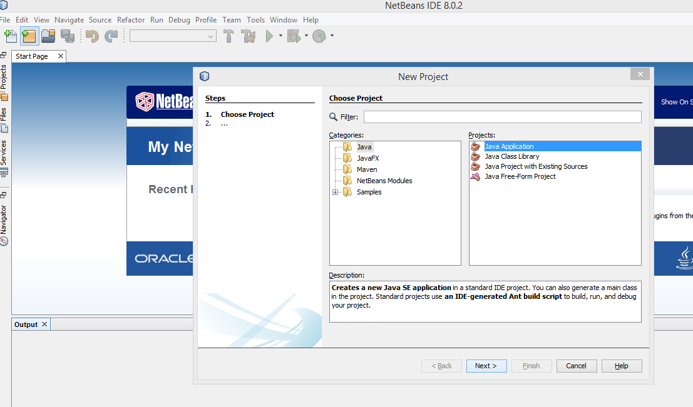


```java

package miprimeraappenjava; //Crea una carpeta con el nombre de la clase
import javax.swing.*; //Importo toda las libreria swing.

public class MiPrimeraAppEnJava {

    public static void main(String[] args) {
      
        JOptionPane.showMessageDialog(null,"Hola Mundo!"); //Muestro en pantalla el mensaje "Hola Mundo!"
        
    }
    
}

```

Los resultados en pantalla:

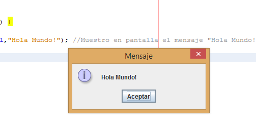


## Comentar el codigo

Existe dos formas de comentar el código en Java:

**Para comentar una sola línea de código**

```java

// Esto es un comentario en java.

```

**Para comentar más de una línea de código**

```java

/* 

Esto es 

un comentario

de más de una linea

*/

```

>Es una buena práctica de la programación comentar nuestro código para recordar con mayor facilidad lo que se hizo en el momento.

## Tipos de datos

También llamados Tipos de variable. Se llaman Tipos primitivos de variable de Java, a aquellas variables sencillas que contienen información habitual: valores boolean, caracteres y números enteros o de punto flotante.

**Java dispone de ocho tipos primitivos de variables:**

- boolean: sirve para almacenar valores true y false.
- char: para almacenar caracteres.
- byte, short, int y long: para almacenar números enteros.
- Float y double: para almacenar valores reales de punto flotante, es decir, números con decimales.

La siguiente tabla muestra la cantidad de valores que puede almacenar cada tipo de variable:

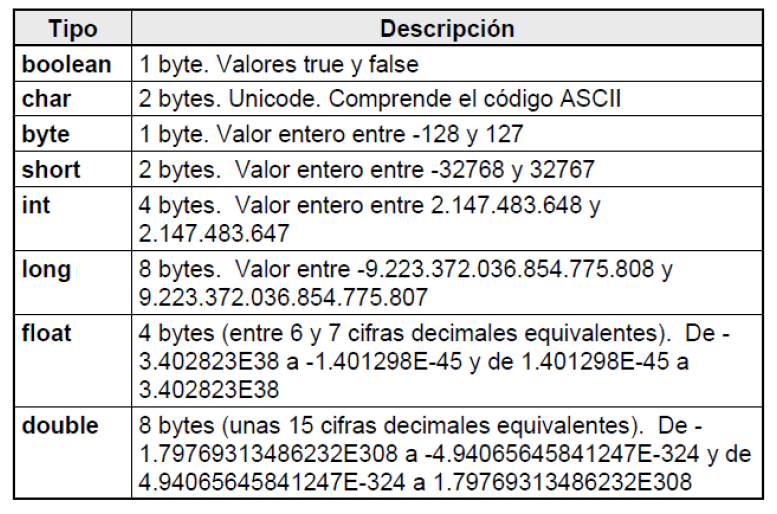

## Variables
Una variable es un nombre que contiene un valor que puede cambiar a lo largo del programa. De acuerdo con el tipo de información que contienen, en Java hay dos tipos principales de variable:

### 1. Variables de tipo primitivos:

Están definidas mediante un valor único que puede ser entero, de punto flotante, carácter o booleano. Java permite distinta precisión y distintos rangos de valores para estos tipos de variables (char, byte, short, int, long, float, double, boolean). Ejemplos de variables de tipo primitivo podrían ser: 123, 3456754, 3.1416, 12e-09, 'A', TRUE, etc...

### 2. Variables de tipo referencias: 

Son objetos en java de una determinada clase y no hacen parte del sistema operativo, como por ejemplo: arrays (arreglos), String (cadenas), etc... Una forma de indentificarlos es cuando los declaran en el tipo de la variable:

```java

	String cadena; // variable que hace referencia a la clase String en java.
	Object obj; // variable que hace referencia a la clase Object en java.

```
### Tipos de nombres asignados a una variable:

Los nombres de variables en Java se pueden crear con mucha libertad. Pueden ser cualquier conjunto de caracteres numéricos y alfanuméricos, sin algunos caracteres especiales utilizados por Java como operadores o separadores (, . + - * / etc...), tampoco podrán ser nombradas con palabras reservadas por la aplicación (main, if, for, while, break, etc...). Estas son las palabras reservadas por el sistema y que no pueden usarse como nombre de variables:


## Operadores aritmeticos

Son operadores binarios (requieren siempre de dos operando) que realizan las operaciones aritméticas habituales: suma (+), resta (-), multiplicación (*), división (/), y resto de la división o modulo (%).

Ejemplo:

```java

int a, b, suma, resta, div, res; // declaracion de variables
a = 9;
b = 4;
suma = a+b;
resta = a-b;
div = a/b;
res = a%b;

```
### Operador modulo

Operador que devuelve el residuo de la división entre dos operando cualquiera de tipo entero. Ejemplo:

```java
int a, b, res;
a = 9;
b = 3;
res = a % b;
```

### Operadores de asignacion

Los operadores de asignación permiten asignar un valor a una variable. El operador de asignación por excelencia es el operador igual (=). La forma general de las sentencias de asignación con este operador es:

*variable = expresión matemática;*

Java dispone de otros operadores de asignación. Se trata de versiones abreviadas del operador (=) que realizan operaciones "acumulativas" sobre una variable.

**Tabla de operadores de asignación**

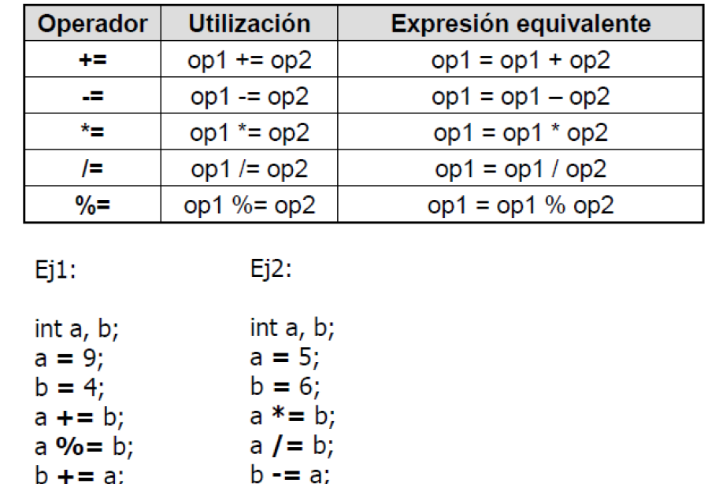

### Operadores de incremento y decremento

Java dispone del operador incremento (++) y decremento (--). El operador (++) incrementa en una unidad la variable a la que se aplica, mientras que (--) la reduce en una unidad. Estos operadores se pueden utilizar de dos formas:

1. Precedido a la variable (por ej; ++i). En este caso primero se incrementa la variable y luego se utiliza (ya incrementada) en la expresión en la que aparece.


2. Siguiendo a la variable (por ej: i++). En este caso primero se utiliza la variable en la expresión (con el valor anterior) y luego se incrementa.

## Operadores relacionales

Los operadores relacionales sirven para realizar comparaciones de igualdad, desigualdad y relación de menor o mayor. El resultado de estos operadores es siempre un valor boolean (true o false) según se cumpla o no la relación considerada. Estos operadores se utilizan con mucha frecuencia en las estructuras de decisión (bifurcaciones) y en las estructuras repetitivas (bucles).

** Tabla de operadores relacionales **

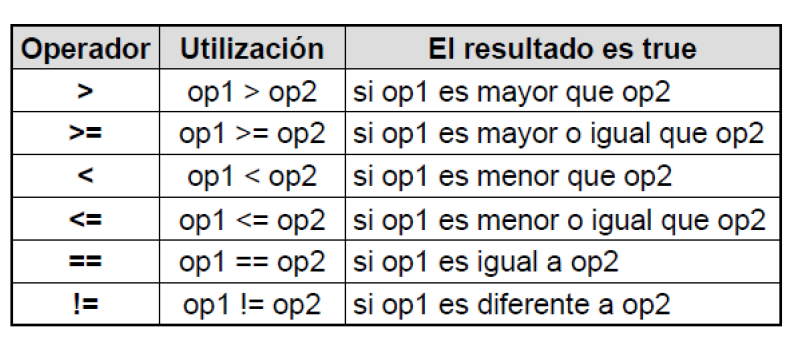

### Operadores logicos

Los operadores lógicos se utilizan para construir expresiones lógicas, combinando los valores lógicos (true/false) o los resultados de los operadores relacionales.

** Tabla de operadores lógicos **

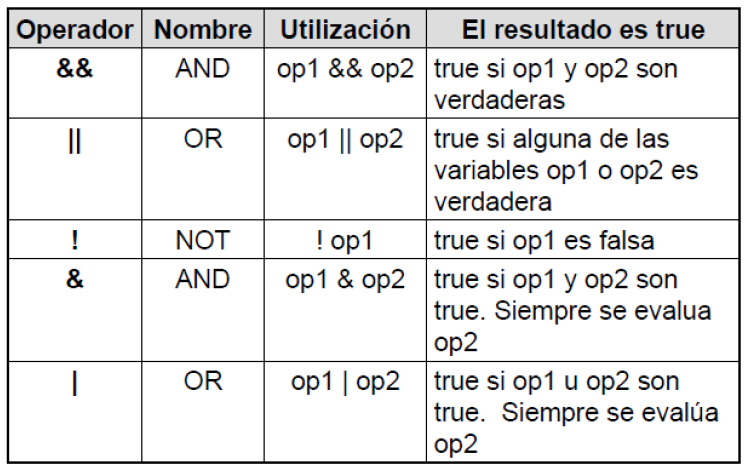


### Precedencia de operadores

El orden en que se realizan las operaciones es fundamental para determinar el resultado de una expresión. Por ejemplo, el resultado de x/y*z depende de qué operación (la división o el producto) se realice primero. Java aplica los operadores en expresiones aritméticas en una secuencia precisa, determinada por las siguientes reglas de precedencia de operadores, que generalmente son las mismas que las que se utilizan en álgebra. La siguiente imagen muestra el orden en que se ejecutan los distintos operadores en una sentencia de mayor o menor precedencia:


** Tabla precedencia de operadores **

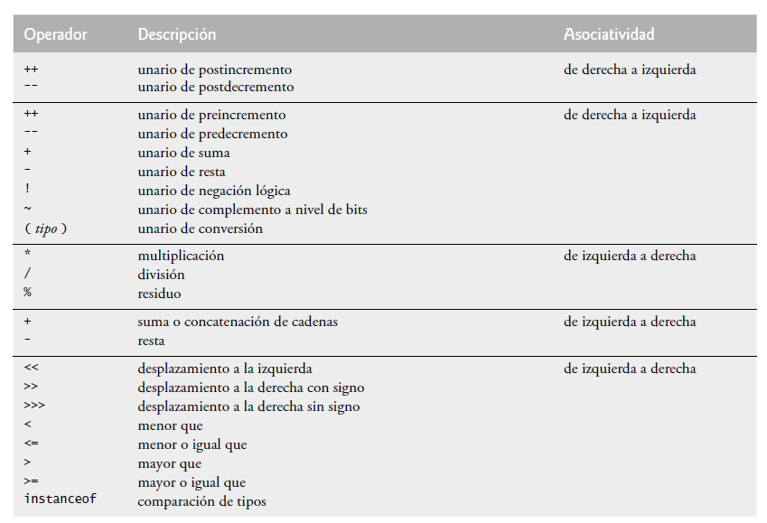


## Promocion de datos o casting

En muchas ocasiones hay que transformar una variable de un tipo a otro, por ejemplo de int a double, o de float a long. En Java se realizan de modo automático conversiones implícitas de un tipo a otro de más precisión, por ejemplo de int a long, de float a double, etc. Las conversiones de un tipo de mayor a otro de menor precisión requieren una orden explícita del programador, pues son convenciones inseguras que pueden dar lugar a errores (por ejemplo, para pasar a short un número almacenado como int, hay que estar seguro de que puede ser representado con el número de cifras binarias de short). A estas conversiones explícitas de tipo se les llama cast. El cast se hace poniendo el tipo al que se desea transformar entre paréntesis, como por ejemplo:

```java
int a=3, b=5, c=7
double result;
result = (double) a / (double)(b+c) ;
```

>En Java no se puede convertir un tipo numérico a boolean.

## Estructura de decision

Las estructuras de decisión o bifurcaciones (como se les llama en Java), permiten ejecutar una entre varias acciones en función del valor de una expresión lógica o relacional. Se tratan de estructuras muy importantes ya que son las encargadas de controlar el flujo de ejecución de un programa.

Existen dos sentencias de decisión diferentes:

- if.
 - if-else.
 - if-else-if-else.
- switch.

### Estructura del if

Esta estructura permite ejecutar un conjunto de instrucciones en función del valor que tenga la expresión de comparación (se ejecuta si la expresión de comparación tiene valor true).

Sintaxis:

```plain
if (Expresión lógica) {

	[bloque de instrucciones]

}
```

Ejemplo:


```java

x=5;
y=10;

if (x < y) {

	JOptionPane.showMessageDialog(null, x + " es menor que " + y); // Muestra en pantalla el resultado que "5 es menor que 10"

}

```

### Estructura del if-else

Funciona de la misma forma que la anterior, de la cual es una ampliación. Las sentencias incluidas en el else
se ejecutan en el caso de no cumplirse la expresión lógica if (expresión de comparación); es decir, si el
resultado de la expresión lógica if es igual a false.

Sintaxis:

```plain

if (Expresión lógica) {

	[bloque de instrucciones 1]

	}else{

		[bloque de instrucciones 2]
}

```
### Estructura del if-else-if-else

Permite introducir más de una expresión de comparación. Si la primera condición no se cumple, se compara la segunda y así sucesivamente. En el caso de que no se cumpla ninguna de las comparaciones se ejecuta las instrucciones correspondientes al else.

Sintaxis:

```plain

if (Expresión lógica 1) {

	[bloque de instrucciones 1]

}else if(Expresión lógica 2){

		[bloque de instrucciones 2]

	}else if(Expresión lógica 3){

			[bloque de instrucciones 3]
			
			}else{

				[bloque de instrucciones 4]
}

```

### Estructura del switch

Se trata de una alternativa a la sentencia if else if else cuándo se compara la misma expresión con distintos valores.

Sintaxis:

```plain

switch (Variable a evaluar o Expresión) {
	case valor1: [bloque de instrucciones 1]
	break;
	case valor2: [bloque de instrucciones 2]
	break;
	case valor3: [bloque de instrucciones 3]
	break;
	.
	.
	default: [bloque de instrucciones 3]
}

```

#### Caracteristicas del switch

1. La sentencia case se corresponde con un único valor de expresión. No se pueden establecer rangos o condiciones sino que se debe comparar con valores concretos.

2. Los valores no comprendidos en ninguna sentencia case se pueden gestionar en default, que es opcional.

3. En ausencia de break, cuándo se ejecuta una sentencia case se ejecutan también todas las case que van a
continuación, hasta que se llega a un break o hasta que se termina el switch.

Ejemplo:

```java

// Escriba un algoritmo que permita mostrar la equivalencia en número decimal de los números romanos (I,V,X,L,C,D,M). 

import javax.swing.*;
 
public class EjemploEstructuraDecision {
 
    public static void main(String args[]) {
 
        char x;
 
        x = JOptionPane.showInputDialog("Digite algunos de los siguientes números romanos [I,V,X,L,C,D,M]: ").charAt(0);
        //Al final se le pone .charAt(0) para tomar el primer valor que digite el usuario en teclado.
 
        x -= 32; //Esto convierte la letra en mayuscula (por si el usuario lo escribe en minuscula...). De mayuscula a minuscula se suma 32.
 
        switch (x) {
            case 'I':
                JOptionPane.showMessageDialog(null, "La letra " + x + " corresponde al número 1");
                break;
            case 'V':
                JOptionPane.showMessageDialog(null, "La letra " + x + " corresponde al número 5");
 
                break;
            case 'X':
                JOptionPane.showMessageDialog(null, "La letra " + x + " corresponde al número 10");
 
                break;
            case 'L':
                JOptionPane.showMessageDialog(null, "La letra " + x + " corresponde al número 50");
 
                break;
            case 'C':
                JOptionPane.showMessageDialog(null, "La letra " + x + " corresponde al número 50");
 
                break;
            case 'D':
                JOptionPane.showMessageDialog(null, "La letra " + x + " corresponde al número 500");
 
                break;
            case 'M':
                JOptionPane.showMessageDialog(null, "La letra " + x + " corresponde al número 1000");
                break;
 
            default:
                JOptionPane.showMessageDialog(null, "Error: Digite I,V,X,L,C,D,M ");
 
        }//Fin del switch
    }
}//Fin del programa

```
## Estructuras de repeticion

Un bucle se utiliza un proceso repetidas veces. El código entre las llaves {} (opcionales si el proceso repetitivo consta de una sola línea), se ejecutará mientras se cumpla unas determinadas condiciones. Hay que prestar especial atención a los bucles infinitos, hecho que ocurre cuando la condición de finalizar el bucle (expresión lógica) no se llega a cumplir nunca. Se trata de un fallo muy típico, habitual entre programadores con poca experiencia.

Existen tres (3) bucles o ciclos a saber:

1. for
2. while
3. do – while

### Estructura for

Sintaxis:

```plain
for (inicialización de variable; expresión lógica; incremento){
[Bloque de instrucciones]
}
```
La sentencia(s) de Inicialización de variable(s) se ejecuta(n) al comienzo del for, e incremento después de que se ejecute el bloque de Instrucciones. La expresión lógica se evalúa al comienzo de cada iteración; el bucle termina cuándo la expresión de comparación toma el valor de false. NOTA: Cualquiera de las tres partes puede estar vacía. La inicialización y el incremento pueden tener varias expresiones separadas por comas.

Ejemplo:

```java

for(int i=1; j=i+10; i<5; i++, j=2*i){
	System.out.println("i= " + i + "j= " + j);
}
/*El siguiente bloque de ejemplo imprimirá los siguientes datos:

i= 1	j= 11
i= 2	j= 4
i= 3	j= 6
i= 4	j= 8

*/

```

### Estructura for each

Sintaxis:

```java

for (<Tipo> elemento : Collection){
      //TODO: Bock code here...
      // la variable temporal elemento, contiene cada dato de la colección a iterar.
    }

```

Ejemplo:

```java

    String[] arreglo = new String[3];
    arreglo[0] = "Victor";
    arreglo[1] = "Jaime";
    arreglo[2] = "Harry";
    
    for (String elemento : arreglo){
      System.out.println(elemento);
    }

```


### Estructura while

En el ciclo while se ejecutan todas las instrucciones contenidas en el bloque mientras la expresión lógica sea verdadera (true); estas se ejecutan n veces, hasta cuándo la expresión lógica dé como resultado falso (false) lo cual hace que finalice el ciclo.

Sintaxis:

```plain

while (Expresión lógica) {
[bloque de instrucciones]
}

```

Ejemplo:

```java

// Escriba un algoritmo que dados los valores X y N, permita calcular X^N. [Hacer con estructura WHILE]

import javax.swing.*;

public class EstructuraWhile {
    public static void main (String args[]){
        double x, p=1;
        int n, i;
        x = Double.parseDouble(
                JOptionPane.showInputDialog("Digite la base: ")
                );
        n = Integer.parseInt(
                JOptionPane.showInputDialog("Digite el exponente: ")
                );
 
 
 
        if (n>=0){
 
            i=1; //Debo darle valor a la variable que va a servir como contador antes de entrar al bucle.
 
            while(i<=n){
                p*=x;
                i++; //Aquí modifico el contador porque sino entonces me quedaría un bucle infinito.
            }
        }
 
        else{
 
            i=-1;
 
            while(i>=n){
                p*=1/x;
                i--;
            }
 
        }
 
        System.out.println("La potencia es = " + p);
 
        /*Supongamos que el usuario digite como base x=5 y como exponente n=2, entonces el resultado que debe mostrar en pantalla es: La potencia es = 25
         * Supongamos que el usuario digite como base x=5 y como exponente n=-2, entonces el resultado que debe mostrar en pantalla es: La potencia es 0.04
         */
 
    }
} //fin del programa

```

### Estructura do-while

Es similar al bucle While pero con la particularidad de que el control está al final del bucle (lo que hace que el bucle se ejecute al menos una vez, independientemente de que la condición se cumpla o no). Una vez ejecutado el bloque de instrucciones, se evalúa la condición: si resulta verdadera (true) se vuelven a ejecutar las sentencias y/o instrucciones contenidas en el "bloque de instrucciones del do-while", mientras que si la condición se evalúa a Falso (false) finaliza el bucle.

Sintaxis:

```plain

do {
[bloque de instrucciones]
} while (Expresión lógica);

```

Ejemplo:

```java

// Ejemplo: Escriba un algoritmo que dados los valores X y N, permita calcular X^N. [Hacer con estructura DO WHILE]

import javax.swing.*;

public class do_whileee {
   public static void main (String args[]){
       
       double x, p=1;
       int n, i=1;
       
       x = Double.parseDouble(
               JOptionPane.showInputDialog("Digite la base: ")
               );
       n = Integer.parseInt(
               JOptionPane.showInputDialog("Digite el exponente: ")
               );
       
       if(n>=0){
           do{
               p*=x;
               i++;
           }while(i<=n);
       }else{
           do{
               p*=1/x;
               i--;
           }while(i>=n);
       }
       
       System.out.println("La pontencia es: " + p);
 
        /*Supongamos que el usuario digite como base x=5 y como exponente n=2, entonces el resultado que debe mostrar en pantalla es: La potencia es = 25
         * Supongamos que el usuario digite como base x=5 y como exponente n=-2, entonces el resultado que debe mostrar en pantalla es: La potencia es 0.04
         */
 
    }
}

```

## Arreglos

En Java, un arreglo es un grupo de variables (llamadas elementos o componentes) que contienen valores, todos del mismo tipo. Recuerde que los tipos en Java se dividen en dos categorías: tipos primitivos y tipos de referencia. Los arreglos son objetos, por lo que se consideran como tipos de referencia. Los
elementos de un arreglo pueden ser tipos primitivos o de referencia (incluyendo arreglos). Para hacer referencia a un elemento específico en un arreglo, debemos especificar el nombre de la referencia al arreglo y el número de la posición del elemento en el arreglo. El número de la posición del elemento se conoce formalmente como el índice o subíndice del elemento.

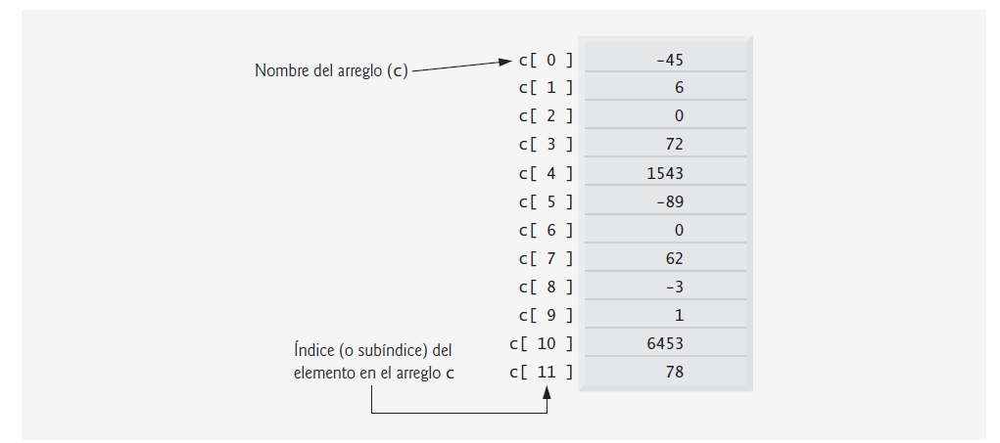


### Arreglos unidimensionales

Los arreglos unidimensionales son los tipos de datos que nos permite almacenar una cantidad finita de datos u objetos y a su vez, los datos se guardan con un valor de referencia llamado "subíndice", el cual, nos permitirá consultar cualquier dato dentro del arreglo con dicho número de subíndice.

#### Características de un arreglo unidimensional:

- Estructura de almacenamiento estática (No puede cambiar su longitud después de haberla creado), que permite referenciar datos u objetos con un mismo nombre, que es posible distinguir entre sí, por un subíndice.
- Es homogénea es decir, contiene solo un tipo de dato.
- Su aplicación se enmarca al uso masivo de datos, mediante la ayuda de los ciclos.
- Para consultar la longitud del arreglo, se utiliza el atributo nombre_arreglo.length

Sintaxis:

>Se puede declarar un arreglo con o sin el tamaño de longitud, pero es importante tener claro que el arreglo deberá tener especificado dicha longitud, antes de ser usado.

```java

double notas [] = new double[10];

// Definir arreglos de forma directa:

int edades [] = {16, 15};

char vocals []= {'a','e','i','o','u'};

String dias[]={"lunes", "martes", "miercoles", "jueves", "viernes", "sabado"};

```

También es muy común llenar los arreglos con el uso de ciclos:

```java

String nombres[] = new String [40];

for (int i=0 ; i < nombres.length ; i++){
	nombres[i] =JoptionPane.showInputDialog("Ingrese nombre "+ (i + 1)+":" );
}

```

Como también, el uso de ciclos para imprimir los datos que están almacenados en el arreglo:

```java

String nombres[] = new String [40];

for (int i=0 ; i < nombres.length ; i++){
	JOptionPane.showMessageDialog(null, nombres[i]);
}

```

### Arreglos bidimensionales

Los arreglos multidimensionales de dos dimensiones se utilizan con frecuencia para representar tablas de valores, las cuales consisten en información ordenada en filas y columnas. Para identificar un elemento específico de una tabla, debemos especificar dos subíndices. Por convención, el primero identifica la fila del elemento y el segundo su columna. Los arreglos que requieren dos subíndices para identificar un elemento específico se llaman arreglos bidimensionales (los arreglos multidimensionales pueden tener más de dos dimensiones). Java no soporta los arreglos multidimensionales directamente, pero permite al programador especificar arreglos unidimensionales, cuyos elementos sean también arreglos unidimensionales, con lo cual se obtiene el mismo efecto.

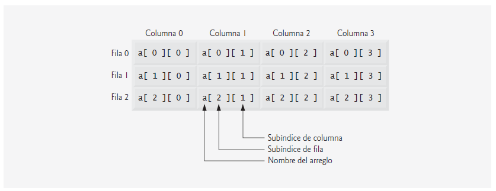

Ejemplos de declaracion de arreglos [sitanxis]:

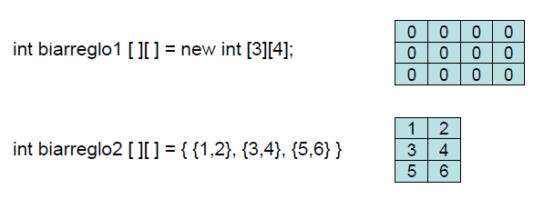


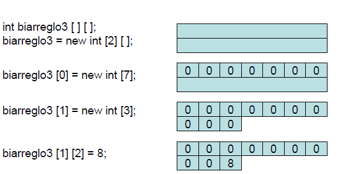

>Se permite que dentro de cada fila se tenga diferente número de columnas

#### Acceso a un dato

Para acceder a los diferentes elementos del arreglo, se realiza mediante el nombre del arreglo y su posición correspondiente escrita en dos corchetes, donde primero van las filas y luego la columna:

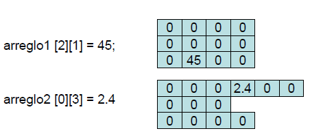

#### Recorrido

Si se desea recorrer todo el arreglo para consultar los datos, se debe hacer dos ciclos aninados, uno que recorra las filas y el otro las columnas.

Sintaxis:

```java

for(int i=0; i < biarreglo.length; i++){
	
	for(int j=0; j < biarreglo[i].length; j++){

		// Bloque de instrucciones
	}
}

```

### Usos habituales en los arreglos

#### Busquedas

Se trata de recorrer todo el arreglo hasta encontrar un dato buscado.

```java

// Verificar si en el arreglo denominado "carreras" se ha almacenado la carrera "Ingeniería Informática".
 
for (int i=0 ; i< carreras.length ; i++){

	if (carreras[i].equals (“Ingeniería Informática”){
    	    JOptionPane.showMessageDialog (null, “La carrera buscada se encontró en la posición”+i);
	}
}

```

#### Conteos

```java

// Cuantos estudiantes del curso de Java, aprobaron y cuantos reprobaron.
 
int aprobaron=0, reprobaron=0; // Contadores

for (int i=0 ; i< notas.length ; i++){

        if (notas[i] >= 3){
                aprobaron ++;
        }else{
                reprobaron++;
    }
}

JOptionPane.showMessageDialog (null,
      “Número de estudiantes que aprobaron: “ + aprobaron +
		“ \n Número de estudiantes que reprobaron: ” + reprobaron);
}

```

#### Mayor y menor

Aquí se puede presentar dos casos:

- Si se conoce el dominio de los datos. Por ejemplo: Las notas son entre 0 y 5.
- No se conoce el dominio de los datos. Por ejemplo: el mayor y menor de un conjunto de números reales
dados.

Si se conoce el dominio de los datos, entonces esta serían las recomendaciones:

- La variable que almacenará el mayor debe iniciar en el valor más bajo posible.
- La variable que almacenará el menor debe iniciar en el valor más alto posible.
- De allí en adelante se compara el dato a procesar con lo que se lleva como mayor o como menor.
- Estas variables (mayor y menor se deben reasignar si se encuentra un nuevo mayor o menor).

Ejemplo:

```java

//Encuentre la nota mas alta y la mas baja del curso de Java.
 
double mayor=0, menor=5;

for (int i=0 ; i< notas.length ; i++){

        if (notas[i] > mayor)
                mayor = notas[i];

        if (notas[i] < menor)
                menor = notas[i];
}

JOptionPane.showMessageDialog (null, “La nota más alta fue: “ + mayor + 
									“\nLa nota mas baja fue: ” + menor);

```

Recomendaciones para cuando no se conoce el dominio de los datos:

- La variable que almacenará el mayor y el menor se deben iniciar en el primer valor conocido.
- De allí en adelante se compara el dato a procesar con lo que se lleva como mayor o como menor.
- Estas variables (mayor y menor se deben reasignar si se encuentra un nuevo mayor o menor).

Ejemplo:

```java

// Encuentre el mayor y el menor de un grupo de números reales cualquiera.
 
double mayor=numeros[0], menor=numeros[0];

for (int i=0 ; i< numeros.length ; i++){

        if (numeros[i] > mayor)
                mayor = numeros[i];

        if (numeros[i] < menor)
                menor = numeros [i];
}

JOptionPane.showMessageDialog (null, “El número mayor es: “ + mayor + 
										“\nEl número menor es: ” + menor);

```

## Programacion orientado a objetos

La programación orientada a objetos es un paradigma surgido en los años 70, que utiliza objetos como elementos fundamentales en la construcción de la solución. Un objeto es una abstracción de algún hecho o ente del mundo real, con atributos que representan sus características o propiedades, y métodos que emulan su comportamiento o actividad. Todas las propiedades y métodos comunes a los objetos se encapsulan o agrupan en clases. Una clase es una plantilla, un prototipo para crear objetos; en general, se dice que cada objeto es una instancia o ejemplar de una clase. la POO está basado en varias técnicas, incluyendo herencia, cohesión, abstracción, polimorfismo, acoplamiento y encapsulamiento. Su uso se popularizó a principios de la década de los años 1990. En la actualidad, existe una gran variedad de lenguajes de programación que soportan la orientación a objetos.


### Evolucion

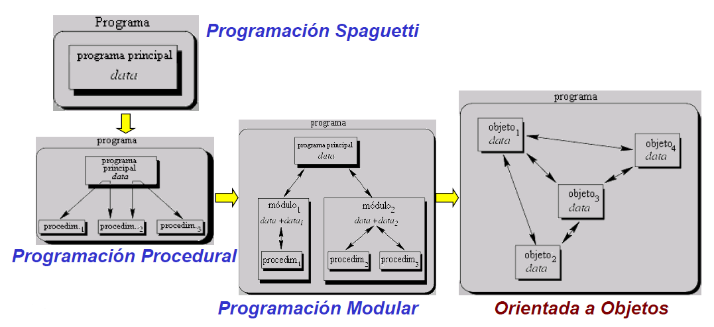

## Clases

Para definir una clase en JAVA, se emplea la palabra clave `class` seguida por el nombre de la clase, el cual se recomienda que esté escrito en singular e iniciando con letra mayúscula; este nombre debe ser representativo de los elementos que contiene la clase.

Ejemplo:

class Circulo 
class Pago
class Caja 
class Televisor
class Empleado 
class Rectangulo
class Cliente 
class Libro

**Forma de una clase:**

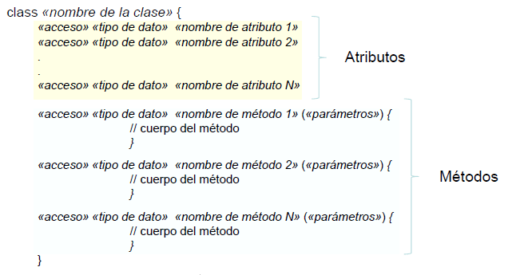

## Objetos

Es un ejemplar concreto de una clase. Las clases son como tipos de variables, mientras que los objetos son como variables concretas de un tipo determinado.

Sintaxis:

`«Nombre de la Clase» NombreDeObjeto;`

Ejemplo:

```java

Persona p1; p1 = new Persona();
Circulo cl; cl = new Circulo();

```

Cada objeto es una copia de una clase, se dice entonces que cada objeto de una clase dada contiene la estructura y el comportamiento definidos por la clase. A la creación de un objeto se le llama instancia de una clase. La clase es una construcción lógica, el objeto tiene la realidad física.

### Caracteristicas

- Estado (atributos o características).
- Comportamiento (métodos asociados).
- Identidad (ocupa un lugar en memoria).
- Ciclo de vida.
- Visibilidad.
- Relación y colaboración con otros objetos.

### Instanciar un objeto

Los objetos se crean en dos pasos:

- Declaración, donde se proporciona un nombre al objeto y se determina a que clase pertenece.

`NombreClase obj;`

- Se obtiene una copia física del objeto y se asigna a la variable, esto se hace con el operador `new`.

`obj = new NombreClase();`

Los dos pasos pueden llevarse a cabo en una sola instrucción así:

`NombreClase obj = new NombreClase();`

Representación gráfica:

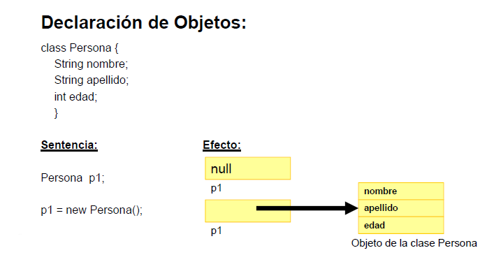


## Atributos

Los atributos corresponden a las características (o datos) necesarios para describir una clase.
Los atributos pueden corresponder a cualquier tipo de dato (int, long, double, char, String, …, etc).

Ejemplo:

La clase “Persona” probablemente deberá tener definido los siguientes atributos:

```java

String codigo;
String nombre;
double salario_basico;
int edad;
char sexo;

```

** Consideraciones para la definición de Atributos: **

- El nombre debe cumplir con las reglas de los identificadores.
- El nombre debe orientar sobre el significado del dato que`almacena.
- Visibilidad - Tiene asociado un modificador de acceso: públicos, privados, package (default) ó protected.

## Metodos

Sintáxis:

```plain

«acceso» «tipo» «nombre del método» («parámetros») {
// cuerpo del método
}

```
Tipo: Corresponde al tipo de dato que retornará dicho método (int, long, float, double,`String, char,…, etc) a una clase definida previamente, o void si el método no retorna ningún dato. Todo método debe tener una clausula return a menos que éste sea de tipo void.

Parámetros: corresponde a un listado de declaración de variables separados por coma, que corresponde a los datos que el método requiere para realizar su función.

Ilustración gráfica de posibles métodos:

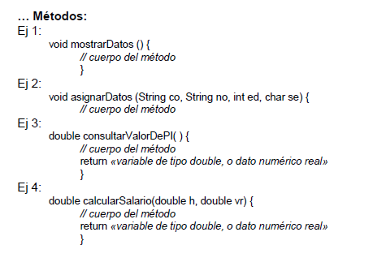

**Consideraciones para la definición de Métodos:**

- Tienen un nombre: debe cumplir las reglas de los identificadores.
- Por estándar inician en minúscula y si tienen palabras compuestas estas inician con mayúscula.
- Pueden retornar algo como resultado: un dato, un objeto o un arreglo.
- Pueden requerir de argumentos para hacer sus cálculos.
- Visibilidad - Tiene modificador de acceso asociado: públicos(public), privados(private), package (default) ó protegidos(protected).

## Setter y getter

Los setter y getters, son métodos de acceso en una clase, estos sirven para establecer y obtener datos de los atributos de nuestra clase, estos dos métodos deben ser públicos.

setter : para cambiar el valor de los atributos.
getter : para consultar o recuperar el valor de los atributos.

Ejemplo:

```java

public class Circulo {

public double radio; // declaración de atributo

public void setRadio ( double r ) { // cambia el valor del atributo radio por el valor
	
	radio = r;

	}

public double getRadio () { // Devuelve el valor del atributo radio

	return radio;

	}
}

```

>El uso del set y get es más de una buena practica de la programación, porque igual, funcionaria sin ponerle set y get al principio del nombre del método, pero al utilizarlo, el código será mas claro a la hora de realizarle alguna actualización.

## toString

El método toString de un objeto, retorna la representación de un objeto en formato cadena, pero este método hace parte de la clase padre Object, la cual, se llama en forma **implícita** cuando el objeto se utiliza en donde se espera un objeto String (por ejemplo, cuando printf imprime en pantalla el objeto como un String, usando el especificador de formato %s, o cuando el objeto se concatena con un objeto String mediante el operador +). Pero además, el método toString se puede llamar de manera **explícita**,  sobreescribir dicho método de la clase Object, en otra clase cualquiera y así darle el formato deseado a la representación del objeto de dicha clase.

Ejemplo utilizando los atributos comunes de una clase llamada Persona:

```java


public class Persona {
  
  private String nombre;
  private int edad;
  private String id;

  public Persona(String nombre, int edad, String id) {
    this.nombre = nombre;
    this.edad = edad;
    this.id = id;
  }
  

  public String getNombre() {
    return nombre;
  }

  public void setNombre(String nombre) {
    this.nombre = nombre;
  }
  
  public int getEdad() {
    return edad;
  }

  public void setEdad(int edad) {
    this.edad = edad;
  }

  public String getId() {
    return id;
  }

  public void setId(String id) {
    this.id = id;
  }
  
  @Override // Esto indica que una declaración de método está destinado a anular una declaración de método en una superclase.
  public String toString(){
    return "Nombre: " + nombre + "\nEdad: " + edad + "\nId: " + id;
  }

}

```


## Constructores

Un constructor es un método especial que sirve para darle valores inciales a los atributos cuando se crea un objeto de la clase correspondiente. Dicho método, se llama igual al nombre de la clase, no lleva ningún valor de retorno, ni tipo pero puede tener parámetros de entrada o no tenerlos.

Ejemplo:

```java

public class Circulo{
	
	private double radio;		// atributo.

	Circulo(){					// El constructor puede tener parámetros.
		radio = 3;
	}

}

```

## Ordenamiento de datos

Se considera ordenar al proceso de reorganizar un conjunto dado de objetos (arreglo) en una secuencia determinada, de forma ascendente o descendente según criterio dado.

Cuándo se analiza un método de ordenamiento, se debe determinar cuántas comparaciones e intercambios se realizan.

Métodos de ordenamiento más conocidos:

- Burbuja.
- Inserción.
- Selección.
- QuickSort.
- ShellSort.
- MergeSort.

### Metodo burbuja

El ordenamiento por burbuja (Bubble sort), es conocido como “método de intercambio directo”. Funciona comparando elementos de dos en dos en un ciclo, intercambiándolos según sea el caso (lo que la convierte en un método poco eficiente para una base grande de datos).

>Es necesario revisar i veces toda la lista hasta no necesitar más intercambios.

Descripción gráfica de como funciona el método burbuja:


Sintaxis:

```java

static int [] ordenarBurbuja ( int a[] ) {

int tmp;

for ( int i = 0; i < a.length; i++) {
	for ( int j = 0; j < a.length - 1; j++) {
		
		if (a [ j ] > a [ j+1 ] ) {
			tmp = a [ j ];
			a [ j ] = a [ j+1 ];
			a [ j+1 ] = tmp;
			}
		}
	}

return a;

}

```

Gráficamente:

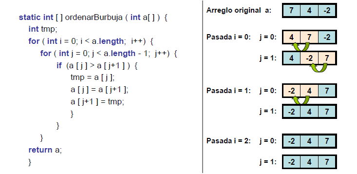


## Sobrecarga de metodos

Sirve para reutilizar el nombre de un método, pero recibiendo número y/o tipos de parámetros diferentes al inicial, esto con el fin de no crear otros métodos que sirven para hacer una misma operación pero con distintos resultados.

Ejemplo:

```java

class Empleado{
	
	double calcular_salario(){	// no recibe parámetros.

		return salario_mensual;

	}

	double calcular_salario(int dias_trab){		// Recibe un parámetro entero.

		return (salario_mensual/30) * dias_trab;

	}


	double calcular_salario(double descuento){	// Recibe un parámetro pero de tipo double.

		return salario_mensual * (1-descuento);

	}
	
}

```
## Sobrecarga de constructores

Al igual que cualquier método, el constructor también se puede sobrecargar, teniendo en cuenta las mismas restricciones que un metodo sobrecargado (mismo nombre, parámetros distintos):

Ejemplo:

```java

public class Circulo{
	
	private double radio;		// atributo.

	Circulo(){					// Constructor sin parámetros de entrada.
		radio = 3;
	}

	Circulo(double x){			// Constructor con parámetros de entrada.
		radio = x;
	}

}

```

## Apuntador this

Si un objeto de una clase en particular quisiera hacer referencia a uno de sus miembros (atributos o metodos) sin equivocación alguna, puede emplear el apuntador this, el cual se puede entender como una variable que apunta hacia el mismo.

Ejemplo:

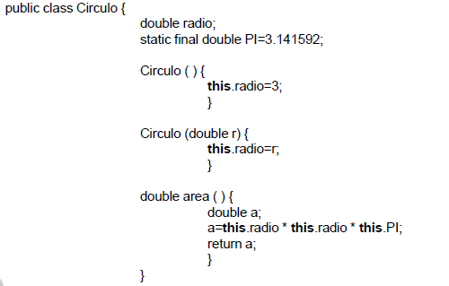


## Ambitos de variables

**Variables de clases**: Definidas y disponibles duarante la ejecución del programa.

**Variables de instancia**: Definidas durante la existencia del objeto o instancia.

**Variables locales**: Definidas durante la existencia del método. Tienen prioridad sobre las variables globales.

**Apuntador this**: Se utiliza dentro de cualquier método para referirse al objeto actual.

Gráficamente:

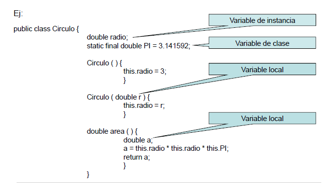


## Paquetes

Sirve para ubicar todas las clases relacionadas en un mismo directorio (o carpeta) en el disco duro o donde esté guardado el programa. De esta forma, nos ayuda tener una buena organización de las clases creadas en java.

Sintaxis:

`package NombreCarpeta;`

>Se pone al principio de cada clase.

Ejemplo:

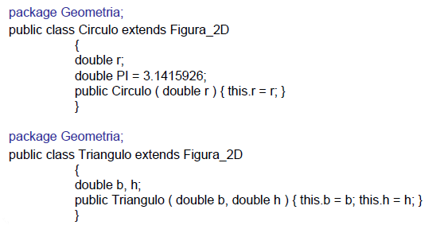

## Modificadores de acceso

Es el control de acceso que le damos a las clases, métodos o atributos, con el fin de lograr un buen nivel de encapsulamiento y proteger los datos que no deberían de ser accesible por cualquiera.

Sintaxis:

```java

public / protect / private / static / final class NombreClase        // Control de acceso a las clases.

public / protect / private / static / final /*tipo de variable de retorno*/ nombreDelMetodo     //Control de acceso para métodos

public / protect / private / static / final nombreVariable        //Control de acceso a variables.

```

### public

Cualquier clase desde cualquier lugar, podrá tener acceso a las variables y métodos públicos.

### private

Son las variables y métodos que solo podrán ser accesados por medio de la misma clase donde están creados. Ni siquiera podrán ser empleados por subclases.

### protected

Cuando un miembre (atributo o método) de clase se declara protected, puede ser accesado por miembros de la misma clase o de subclases de esta.

Un miembro protected puede ser accesado  desde otra clase que se encuentre en el mismo paquete o no.

### static

Normalmente los miembros definidos dentro una clase se denomina miembros de instancia,  ya que al crear instancias (objetos) de la clase se crea una copia de cada miembro para esa instancia.

En algunas formas es aconsejable o necesario declarar miembros de tal forma que existan una copia única para todas las instancias de las clases, a estos miembros se denominan miembros de clase.

Para declarar un atributo o método como miembro de la clase, se antepone la palabra `static`, indicando que será compartido por todos los objetos.

Los miembros de clases ayudan ahorrar espacio en memoria, debido a que guardan datos constantes a todas las clases como por ejemplo el valor PI.

Cuando se declara un atributo static puede ser variado, leído o utilizado por cualquier objeto de clase, pero todos los cambios que se realicen afectarán al mismo atributo para todos los objetos.

Cuando se declara métodos static solamente puede emplear variables static y llamar métodos static.

Ejemplo:

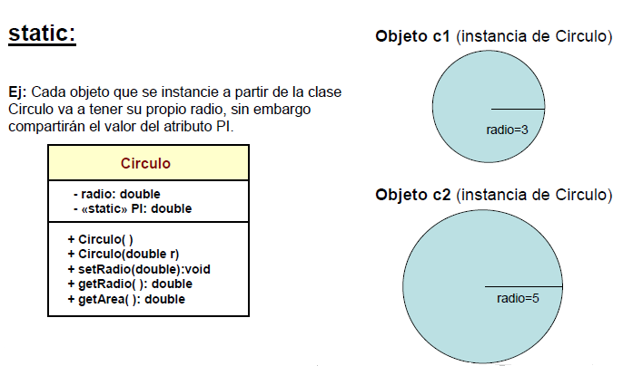

### final


Una clase y sus miembros (atributos o métodos) pueden ser declarados como final.

- A un atributo final no se le puede cambiar su valor.
- Un método final no puede ser sobreescrito por las clases hijas.
- Una clase final no podrá tener subclases asociadas a ella, significa que no podrá ser una super clase.

## Herencia

La herencia es una de las características básicas de la programación orientada a objetos, mediante ella se pueden pasar atributos y métodos de una clase a otra de manera automática, por ello es un punto de apoyo importante para la reutilización de código y por ende ayuda a disminuir el tiempo de programación.

La herencia debe utilizarse en casos precisos donde exista una relación de clasificación entre las clases en mención, es decir, que se pueda indicar que la clase X es una subclase de Y. Por ejemplo, un Cuadrado es una Figura_2D, una Figura_2D es una Figura_Geometrica, un Empleado es una Persona, un Perro es un Animal. Esto es, porque se supone que si una clase es un caso especial (tipo) de otra, tendrán cosas en común; y esas “cosas” se representan a través de sus atributos y/o métodos.

La herencia se estructura a través de clases, y se refleja en los objetos. Una clase hija puede agregar atributos o métodos que le pertenezcan únicamente a ella y no a la clase padre. Un objeto instanciado a partir de una clase hija, tendrá de manera adicional métodos y atributos relacionados en la clase padre.

**Conceptos**:

- Proceso mediante el cual una clase, y como consecuencia su objeto adquiere las propiedades de otro. Permite una clasificación jerárquica establecida mediante superclases y subclases.
- Una subclase aumenta o redefine la estructura y el comportamiento de sus superclases.
- Las superclases representan abstracciones generalizadas, y las subclases representan especializaciones (es un tipo de …).
- Se pueden pasar atributos y métodos a otra clase de forma automática, a excepción de los métodos constructores (estos no se heredan).
- Superclase: Clase padre o clase base, que contiene atributos y métodos en común.
- Subclase: Clase que hereda, clase hija o clase derivada. Clase que recibe la herencia, a la cual se le copian los atributos y métodos especificados en la superclase.

Ejemplo:

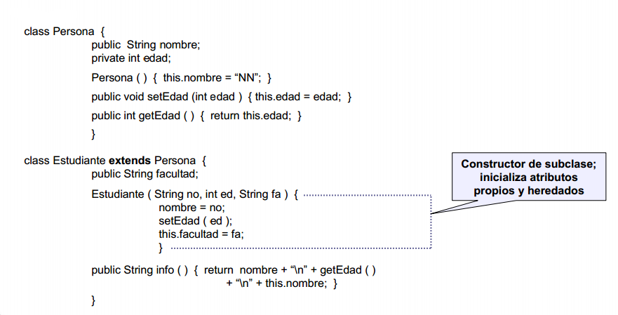

En Java, se admite únicamente la herencia simple; es decir que, cada clase puede heredar a lo sumo de otra clase, y se hace mediante la cláusula extends al momento de declarar la clase.

Ejemplo:

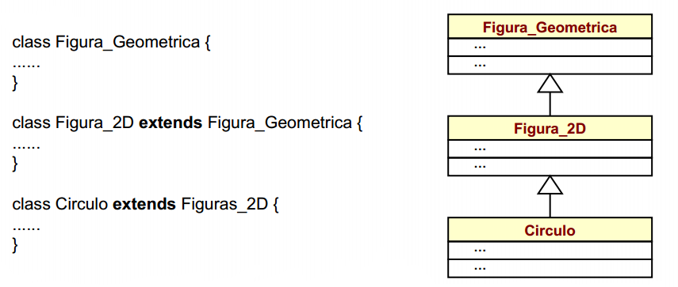

### Sobreescritura de metodos

Cuando una clase hereda un método de otra (porque tiene herencia de dicha clase) puede requerir cambiar parte o la
totalidad del método heredado, en este caso se puede sobrescribir. La sobreescritura implica volver a escribir la implementación del método conservando la misma signatura (tipo de retorno, nombre, cantidad y tipo de parámetros).

Ejemplo:

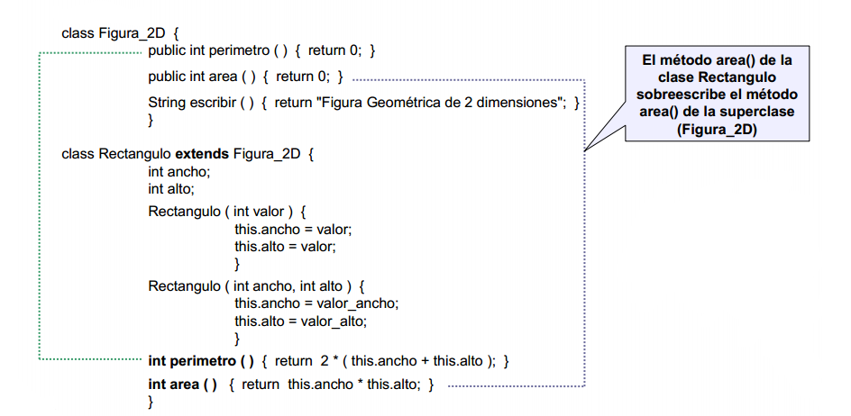

### Apuntador super

Si dentro de una clase se requiere llamar a un método existente en el padre se puede hacer referencia al padre con
la palabra super, la cual puede entenderse como una variable que apunta a la clase Padre.

NOTA: Si dentro de un método en la clase hija, se desea invocar el método de la clase padre, la referencia super debe ser la primera instrucción del método.

Al definir constructores con parámetros, tanto en la subclase como en la superclase. El apuntador super, permite que el
constructor de la subclase, invoque de manera explícita el constructor de la superclase:

```java

public ConstructorNombre (lista parámetros){
  super(lista parámetros);
  // cuerpo de constructor subclase
}

```
Cuando el constructor de la subclase invoca el constructor de su superclase, esta línea tiene que ser la primera.

Ejemplo:

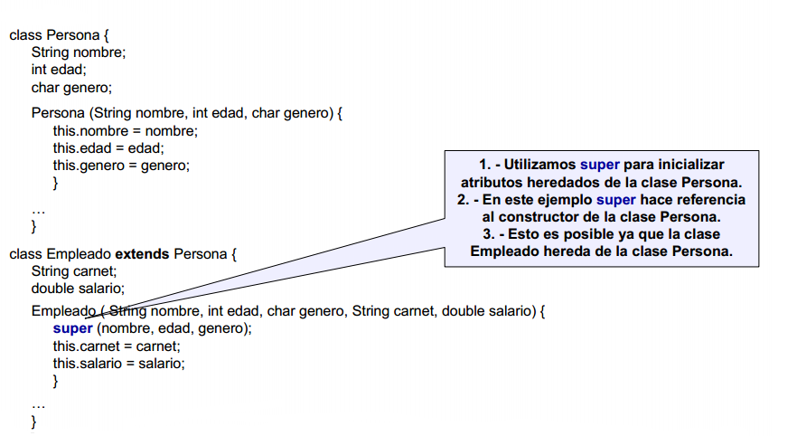

Ejemplo 2:

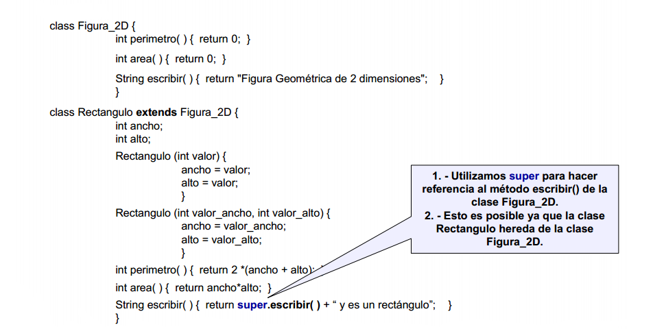


## Abstraccion

La abstracción sirve para la gestión de clases complejas, en el sentido de que, existe una herencia la cual dicha clase padre puede ser tan amplia, tan compleja en sus clases hijas, que sería imposible tratar esa clase padre como una sola. Un ejemplo, para entender esto sería el reino Animal. Si tenemos una clase padre llamada Animal y un correspondiente de clases hijas como Ave, Pez, Perro, Gato, etc... Pues pensar que la clase Animal tenga implementado métodos acerca de cómo nacen, crecen, se reproducen o mueren cada especie animal, sería imposible contemplar dicha idea porque cada espécimen tiene una forma de vida distinta, pero si hay características en común, como por ejemplo, todos los animales tienen un nombre o una edad, la cual se pueden declarar desde la clase padre abstracta, pero sin implementarlo, esto con el fin de hacer uso del polimorfismo en la POO.

Las clases y los métodos se pueden declarar como abstracto.


### Clases abstractas

En Java, una clase abstracta es aquella que tiene al menos un método abstracto. Un método abstracto es un método para el que solamente se ha definido el encabezado (signatura) pero no se ha implementado.

Debido a que una clase abstracta no ha sido definida completamente, no es posible instanciar objetos de ella, sin embargo si puede heredar. Las subclases de las clases abstractas deben implementar (sobreescribir) todos los métodos abstractos.

Ejemplo:

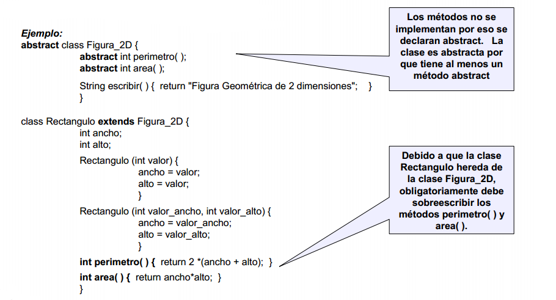


## Polimorfismo

El polimorfismo nos permite programar de forma general, en vez de programar en forma especifica. En particular, nos permite escribir programas que procesen objetos que compartan la misma superclase (ya sea de manera directa o indirecta) como si todos fueran objetos de la superclase; esto puede simplificar la programación. 

Con el polimorfismo podemos diseñar e implementar sistemas que puedan extenderse con facilidad; pueden agregarse nuevas clases con sólo modificar un poco (o nada) las porciones generales del programa siempre y cuando las nuevas clases sean parte de la jerarquía de herencia que el programa procesa en forma genérica.

**Ejemplo de polimorfismo**: 

Suponga que tenemos 3 clases. La clase Animal, que es una superclase abstracta con un método abstracto llamado mover y dos clases hijas de Animal, que son Perro y Ave. No podríamos implementar el método mover de la superclase, porque un perro no se mueve igual que un Ave, por lo tanto cada clase hija deberá implementar su propio método mover, que heredan de la clase padre.

Cuando queramos crear un objeto de cada clase, lo normal sería crear e instanciar un para cada tipo de clase, en este caso, Perro y Ave:

```java
Perro obj = new Perro(); // hemos creado e instanciado un objeto de tipo Perro.
Ave obj2 = new Ave();  // hemos creado e instanciado un objeto de tipo Ave.
obj.mover(); // hacemos uso del método mover de la clase Perro, que hereda de Animal.
obj2.mover(); // hacemos uso del método mover de la clase Ave, que hereda de Animal.
```

Ahora, usando el polimorfismo no tendríamos necesidad de crear un objeto por cada clase, sino que, con un objeto que sea de tipo de la superclase se crea de un tipo de una clase hija, podría hacer uso de los métodos de dicha clase hija, ya que un objeto de una subclase es un objeto de su superclase (pero no viceversa).

```java
Animal obj3 = new Perro(); // creo un objeto Perro pero de tipo Animal.
obj3.mover(); // Llama al método de la clase Perro y no al de la superclase, a pesar de que es un objeto tipo Animal.
```

En conclusión, el polimorfismo es la habilidad de procesar objetos que comparten la misma superclase en una jerarquía de clases, como si todos fueran objetos de la superclase y además, esto facilita la extensibilidad y el mantenimiento de los sistemas.


## Interfaces

En Java, una interfaz es aquella que tiene todos sus métodos sin implementación (pueden ser o no abstractos). Un método
abstracto es un método para el que solamente se ha definido el encabezado (signatura) pero no se ha implementado. Las interfaces
sólo pueden tener atributos definidos como public final static. Una Interfaz se crea de forma similar a una clase, cambiado la palabra reservada class por interface . Debido a que una interface no ha sido definida completamente, no es posible instanciar objetos de ella; puede ser heredada por otra interface, o implementada por una clase. La ventaja de usar interfaces, es que una clase puede implementar varias interfaces, con lo cual Java simula herencia múltiple.

Ejemplo:

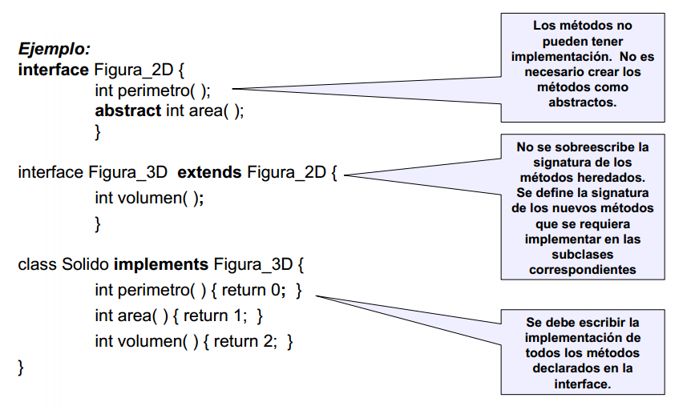

## Manejo de excepciones

Una excepción es un evento que ocurre durante la ejecución de un programa y que interrumpe el flujo normal de instrucciones. Sirve capturar y controlar posibles errores que puedan presentarse en tiempo de ejecución de una aplicación, como por ejemplo: validar una entrada numérica cuándo se solicite el salario de un empleado. ¿Qué sucedería si el aplicativo al solicitar el salario se le digita un nombre?

### Clases de excepciones

- Checked: Condiciones que ocurren en el programa y es posible preveer. Clase **Exception**.
- Unchecked: Situaciones fatales, no se capturan por que no hay nada que hacer. Clase **Error**.

### Atrapar excepciones con try, catch y finally

Palabras reservadas:

**try**: Bloque de código sobre el que se captura la excepción.
**catch**: Bloque de código que se ejecuta si se presenta una excepción (se evalúa bloque de código try).
**finally**: Bloque de código que se ejecuta siempre, exista o no una excepción.

Sintaxis:

```java

//código
try
{
  //código
}
catch (Clase1 nombre) {
  //Que se hace si la excepción de la Clase1 se presenta
}
catch (Clase2 nombre) {
  //Que se hace si la excepción de la Clase2 se presenta
}

//... tantos catch como requiera. catch

finally
{
  //Este bloque de código finally es opcional, y se ejecutará se den o no excepciones
}

//código

```

Ejemplo:

Con relación al siguiente código, que excepción se presentará al usuario si digita un nombre cuándo se le solicita la edad? o si escribe un número real? R// NumberFormatException

Solución:

```java

//Bolque de código

try
{
  int edad;
  edad = Integer.parseInt (
  JOptionPane.showInputDialog("Ingrese edad: ") );
  System.out.println ("Edad = " + edad);
}
catch (NumberFormatException ex) {
  System.out.println ("ERR: Dato Incorrecto! " +
  "\nExcepción presentada: " + ex.toString() );
}

```

A partir de la versión java SE 7 en adelante, se puede crear un bloque catch con varias excepciones. Ejemplo:

```java

try {

} catch (IOException | SQLException ex e) {
    System.err.println("IndexOutOfBoundsException: " + e.getMessage());
}

```

### Excepciones comunes

- ArithmeticException.
- NullPointerException.
- NumberFormatException.
- NegativeArraySizeException.
- ArrayIndexOutOfBoundsException.
- SecutiryException.
 – Accesar a archivos locales.

### Atrapar excepciones con throws y throw

Con las palabras claves `throws` y `throw`.

throws sirve para indicar que en caso de que se produzca una excepción, el método en el que se produce la misma, no la  manejará, sino que la excepcion sera manejada por un método  invocante o superior. En otras palabras, sirve para decirle al que lo invoque que este método puede lanzar una excepción del tipo especificado (pueden especificar varias excepciones separandolas con comas).

Se puede utilizar en conjunto junto con la palabra clave throw, para lanzar de manera explícita, una excepción.

Ejemplo:

El constructor de la clase Alumno no puede ser ni cero ni negativo. Podemos usar la palabra clave throws para indicar que
no  se manejará dicha excepcion en la creación del objeto Alumno, sino en un método superior:

```java

public class Alumno
{
    private String nombre;
    private String apellido;
    private Integer edad;
 
    public Alumno(String nombre, String apellido, Integer edad) throws Exception
    {
       this.nombre = nombre;
       this.apellido = apellido;
        if (edad <= 0){
            throw new Exception("La debe edad ser mayor a cero");
        }else{
            this.edad = edad;
        }
    }
 
    public String getNombre() {
        return nombre;
    }
 
    public void setNombre(String nombre) {
        this.nombre = nombre;
    }
 
    public String getApellido() {
        return apellido;
    }
 
    public void setApellido(String apellido) {
        this.apellido = apellido;
    }
 
    public Integer getEdad() {
        return edad;
    }
}

```

En la clase donde esta el main se podría manejar la excepcion producida al crear un Alumno, de la siguiente manera:


```java

public class Test {
    public static void main (String []arguments){
        try {
            Alumno alu1 = new Alumno("Victor", "tabla_operadores_relacionales_java", -2);
        } catch (Exception e) {
            System.out.println(e.getMessage());
        }
    }
}

```

>También podemos crear nuestras propias excepciones...
